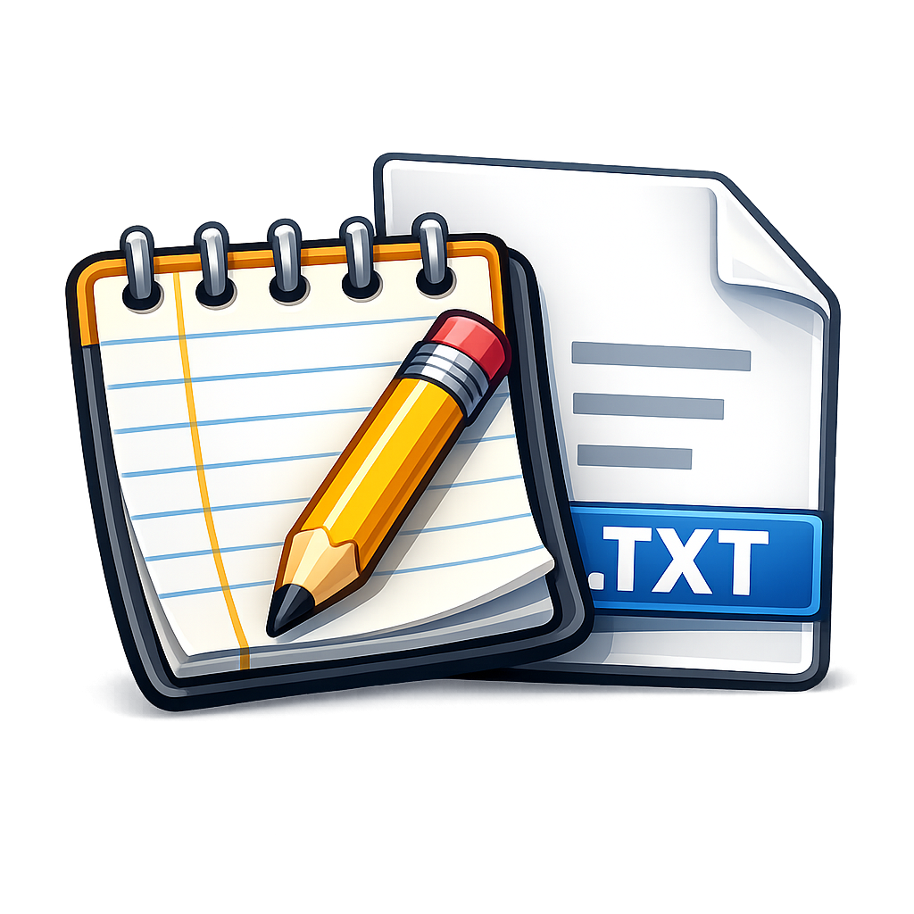

# NotePad

[](https://dotnet.microsoft.com/download/dotnet/9.0)
[](https://learn.microsoft.com/en-us/dotnet/csharp/)
[](https://www.microsoft.com/software-download/windows10)
[](LICENSE)

A lightweight, modern Windows desktop note-taking application built with **.NET 9** and **Windows Forms**. Features dark mode support, line number gutter, find dialog, and a clean modular architecture designed for incremental development.



---

## Table of Contents

- [Features](#features)
- [Tech Stack](#tech-stack)
- [Architecture](#architecture)
- [Quick Start](#quick-start)
- [Build & Run](#build--run)
- [Production Build](#production-build)
- [Keyboard Shortcuts](#keyboard-shortcuts)
- [Future Roadmap](#future-roadmap)
- [License](#license)

---

## Features

| Feature | Status |
|---|---|
| New / Open / Save / Save As | ✅ Implemented |
| Unsaved changes indicator (`*` in title) | ✅ Implemented |
| Close prompt for dirty documents | ✅ Implemented |
| Dark mode (auto-detects system theme) | ✅ Implemented |
| Line number gutter | ✅ Implemented |
| Find dialog (Ctrl+F) | ✅ Implemented |
| Status bar (lines, characters, state) | ✅ Implemented |
| Full Edit menu (Undo, Redo, Cut, Copy, Paste, Select All) | ✅ Implemented |
| Error handling with friendly dialogs | ✅ Implemented |

---

## Tech Stack

| Layer | Technology |
|---|---|
| **Runtime** | .NET 9 |
| **Framework** | Windows Forms |
| **Language** | C# 13 (nullable refs, file-scoped namespaces) |
| **Editor Control** | `RichTextBox` (full Undo/Redo support) |
| **File I/O** | `System.IO` + Common Dialogs |
| **Theming** | Windows Registry-based dark/light detection |

---

## Architecture

```
NotePad/
├── Program.cs                  # Entry point
├── MainForm.cs                 # Main window, menus, close handling
├── Models/
│   └── DocumentState.cs        # POCO: filename, content, dirty flag, counts
├── Services/
│   ├── DocumentStore.cs        # Singleton document state manager
│   ├── FileService.cs          # File I/O helpers (open, save, save-as)
│   └── ThemeHelper.cs          # Dark/light theme detection + colors
└── Controls/
    ├── StatusBar.cs            # Custom status bar (lines, chars, status)
    ├── FindForm.cs             # Modal find dialog
    └── LineNumbers.cs          # Line number gutter
```

### Module Responsibilities

| Module | Responsibility |
|---|---|
| `DocumentStore` | Central singleton managing document state; raises `StateChanged` events |
| `FileService` | Static helpers for `OpenFileDialog`, `SaveFileDialog`, read/write disk |
| `ThemeHelper` | Detects system theme, provides color palette, notifies on theme change |
| `StatusBar` | Custom `UserControl` displaying line count, character count, and status |
| `LineNumbers` | Line number gutter rendered to the left of the editor |
| `FindForm` | Modal search dialog triggered via Ctrl+F |

---

## Quick Start

### Prerequisites

- [.NET 9 SDK](https://dotnet.microsoft.com/download/dotnet/9.0)
- Windows 10 or later

### Clone & Run

```bash
git clone https://github.com/dwyerwilliam/notetakingapp.git
cd notetakingapp
dotnet restore
dotnet run
```

---

## Build & Run

```bash
# Restore dependencies
dotnet restore

# Build (debug)
dotnet build

# Run
dotnet run

# Run without rebuilding (faster iteration)
dotnet run --no-build
```

---

## Production Build

```bash
dotnet publish -c Release -r win-x64 --self-contained true -p:PublishSingleFile=true
```

Output location: `NotePad/bin/Release/net9.0-windows/win-x64/publish/`

---

## Keyboard Shortcuts

| Shortcut | Action |
|---|---|
| `Ctrl+N` | New document |
| `Ctrl+O` | Open file |
| `Ctrl+S` | Save file |
| `Ctrl+F` | Find |
| `Ctrl+Z` | Undo |
| `Ctrl+Y` | Redo |
| `Ctrl+X` | Cut |
| `Ctrl+C` | Copy |
| `Ctrl+V` | Paste |
| `Ctrl+A` | Select All |

---

## Future Roadmap

| # | Feature | Target |
|---|---|---|
| FF-1 | Tabbed multi-document editing | v2.0 |
| FF-2 | Find & Replace | v2.0 |
| FF-3 | Auto-save toggle | v2.0 |
| FF-4 | Syntax highlighting | v3.0 |
| FF-5 | Plugin/extension system | v3.0 |

---

## License

This project is licensed under the [MIT License](LICENSE).
